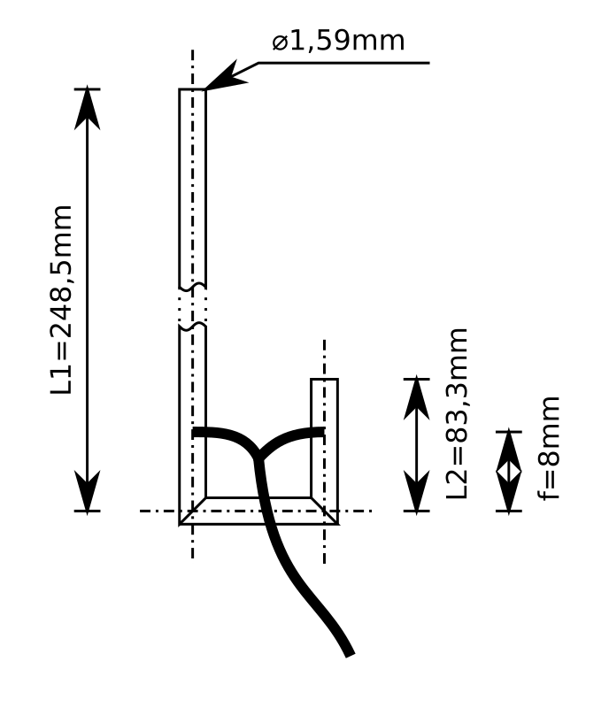
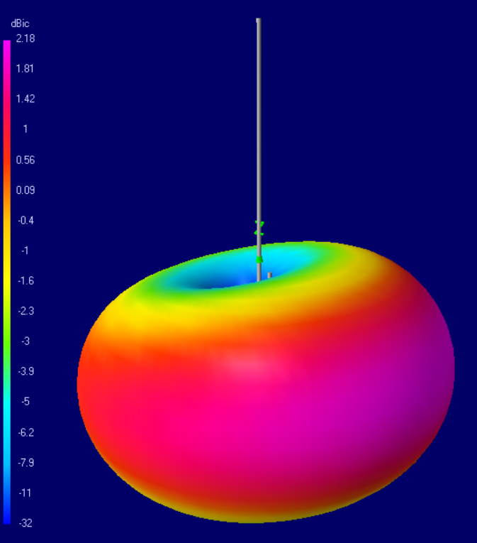
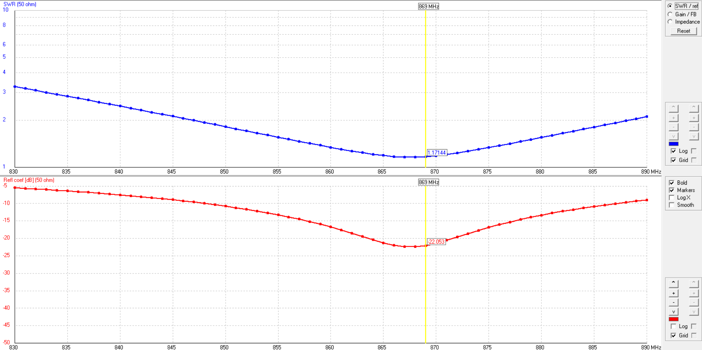
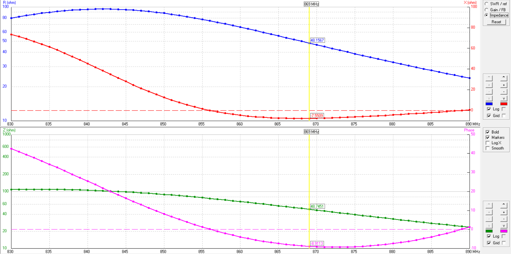
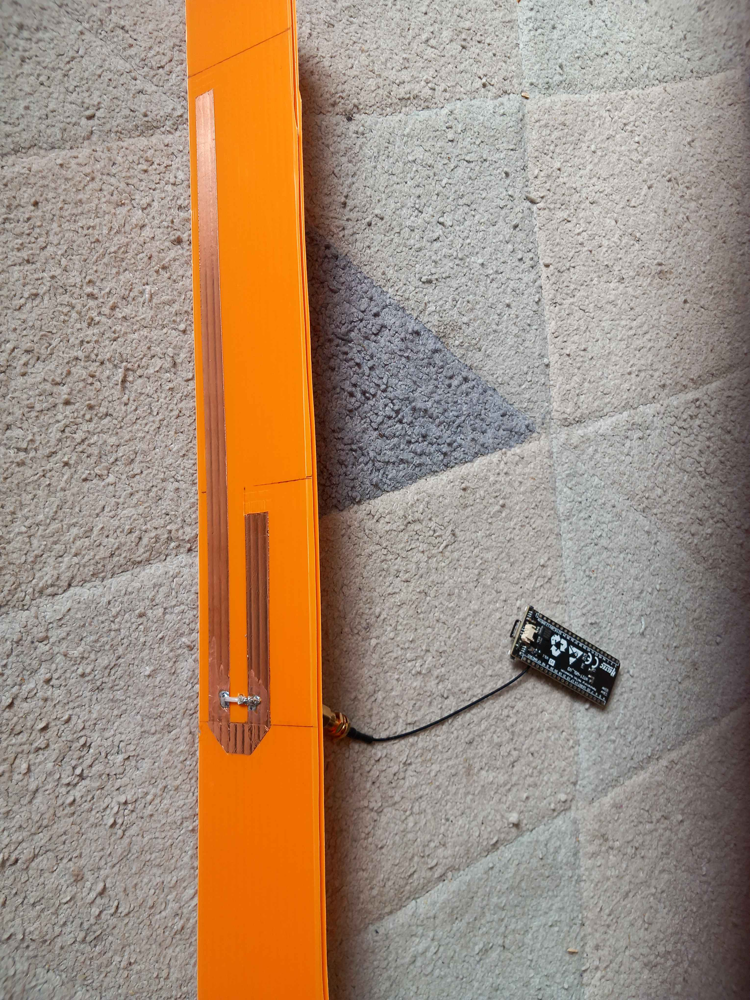
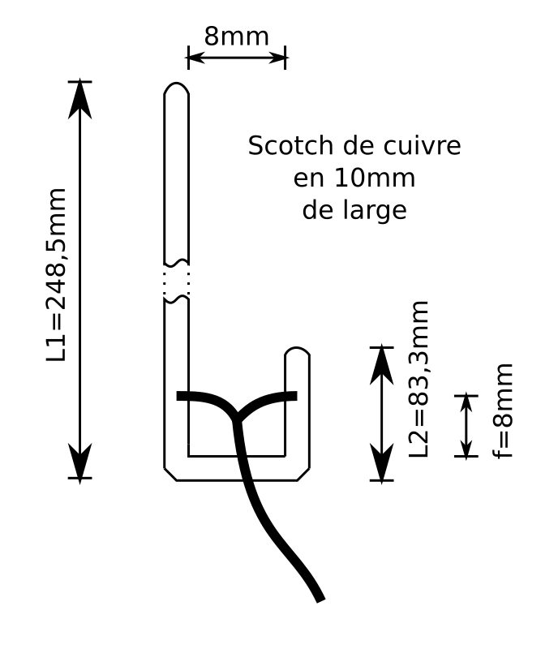

# Antenne J en scotch de cuivre pour Meshtastic

Dans ce projet, nous allons réaliser une antenne J en scotch de cuivre pour [Meshtastic](https://www.meshtastic.org/) (modulation Lora). Cette antenne est conçue pour fonctionner sur la bande 868MHz, qui est utilisée par Meshtastic pour la communication en maillage. Nous allons succintement présenter l'analyse 4NEC2 de l'antenne, puis détailler la réalisation de l'antenne en scotch de cuivre.

## Analyse 4NEC2 de l'antenne J pour Meshtastic

L'[analyse 4NEC2 de l'antenne J pour Meshtastic](j_868.nec) est disponible sur mon GitHub. Les résultats de l'analyse montrent que l'antenne J devrait posséder un gain maximum d'environ 2,2 dBi. L'impédance devrait être se situé autour des 50 ohms. Le SWR est au plus bas avec ces dimensions car j'ai bien entendu lancé l'optimiseur dessus. L'espacement n'a pas grand impact et est de 8mm.

Voilà pour la partie théorique et qui n'a pas d'intérêt particulier à ce stade.
 
## Réalisation de l'antenne en scotch de cuivre

Pour la réalisation, mon idée a été d'utiliser du scotch de cuivre. J'étais probablement inspiré par cet [article de HackADay](https://hackaday.com/2023/10/13/this-packable-ham-radio-antenna-is-made-from-nothing-but-tape/). Bien évidement, la physique étant différente, il y a des ajustements à faire. Or en fouillant le web, il n'y a pas énormément d'études sur le sujet, sauf un article, probablement de W6NBC (note à moi-même: retrouver le lien), qui fait la corrélation entre le périmètre du fils de 4Nec2 et la largeur du scotch de cuivre. C'est de là que vient ce diamètre bizarre de 1,59mm = 1cm / (2 * π).

Bille en tête, je commence alors la réalisation. Pour information j'ai utilisé du scotch Evergreen Goods Ltd Ruban en Cuivre conducteur. Le gros avantage par rapport à d'autre est qu'il n'y a pas besoin de soudure aux jonctions, la colle est suffisament conductrice.

Mais j'ai eu quelques écueuils :

1. Le support n'est pas anodin. Le contre-plaqué par exemple fait trop varier le réglage de l'antenne par rapport à l'humidité. J'ai opté pour un PVC ou Polypropylène alvéolaire (oui comme les panneaux des agents immobiliers). Il résiste aux UVs, est stable électriquement, etc.
2. Les dimensions ne fonctionnaient pas lorsque je passais l'antenne au VNA. J'ai donc commencé à ajuster à la main. C'est lorsque j'ai réalisé une yaggi sur le même principe (je vous en parlerai une autre fois) que j'ai compris l'astuce : les références des mesures ne doivent pas être le centre du scotch ! Pour la yaggi, c'est l'espacement de bord à bord qui était valable. Reprise de mesure et l'intuition est validée.
3. Les angles droits provoquent de nombreuses réflexions visibles au VNA. Un petit coup de cutter en biais les élimine aisément.

## Mesures et expérimentations

Promis, je referais les mesures au VNA pour les ajouter ici.

Côté expérimentation terrain, c'est largement validé, y compris en ville.

## Conclusion

Encore une fois, j'ai beaucoup appris avec une antenne qui est pourtant un classique. Mais sortir légèrement des sentiers battus permet de mieux comprendre les effets sous-jacents.

En résumé, attention au scoth et aux jonctions qui doivent être conductrice ; attention au support qui doit être stable électriquement ; attention aux prises de mesures qui doivent être faites sur les bords du scotch et non en son centre.

J'aurais aimé faire une modélisation [OpenEMS](https://www.openems.de/) qui devrait être beaucoup plus appropriée mais je n'ai toujours pas réussir à faire autre chose que les tutoriels. Ce sera pour une autre fois.