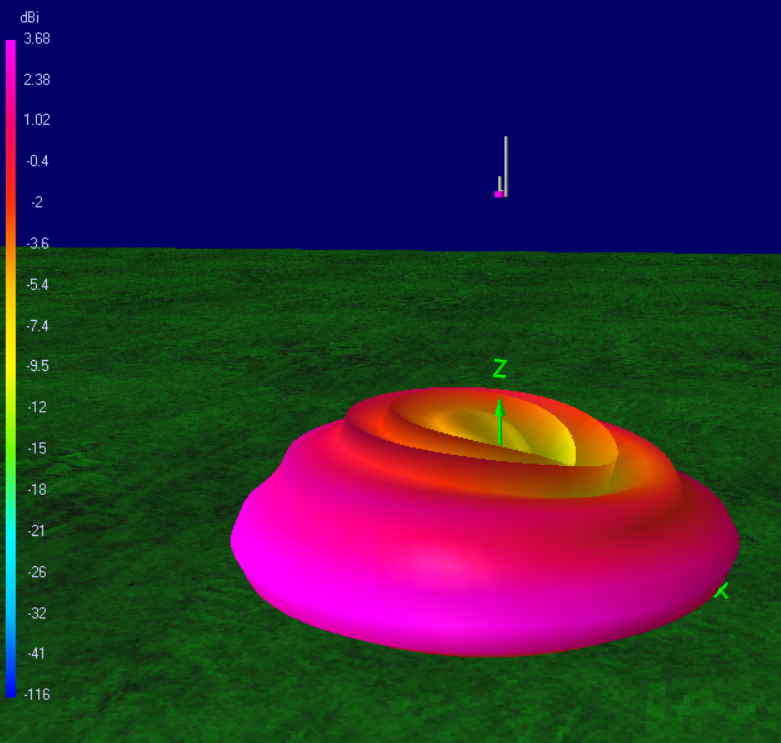
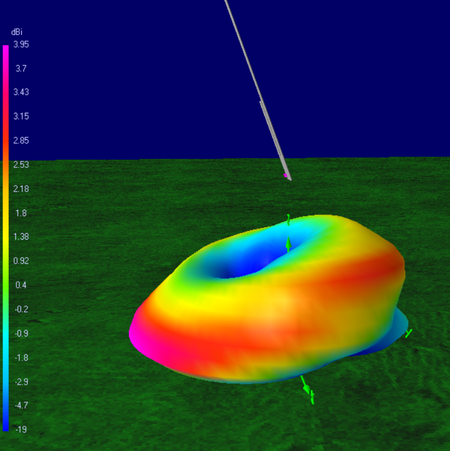
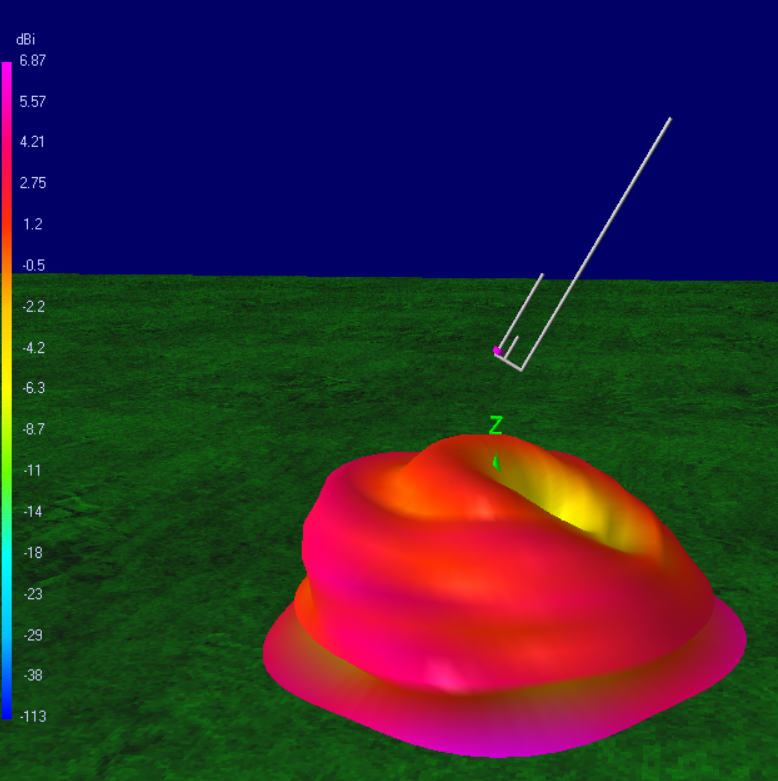
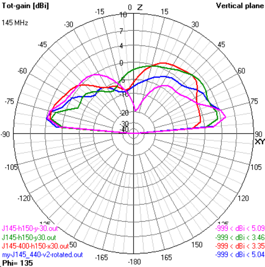
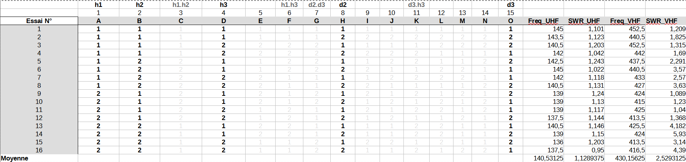

# Antenne double-J pour l'VHF et la UHF

Dans cette étude, j'ai cherché à étudier une antenne qui est fait une combinaison de 2 antennes en J : une partie étant dédiée à l'UHF, l'autre à la VHF.

| paramètre   | dimension |
|-------------|-----------|
| $h_1$       |      470mm|
| $h_2$       |      140mm|
| $h_3$       |     1400mm|
| $d_2$       |       50mm|
| $d_3$       |      150mm|
| rayon       |        2mm|

Voici quelques liens la décrivant :
* https://nt1k.com/open-stub-j-pole-project-completed-many-times/
* https://forums.radioreference.com/threads/open-stub-j-poles.367174/
* http://www.arrowantennas.com/osj/j-pole.html
* https://www.n4nrv.org/build-and-review-dual-band-j-pole-144-440mhz/

Pour rappel, les bandes radio-amateurs :

|    |   min |   max |
|----|-------|-------|
| VHF| 144Mhz| 148Mhz|
| UHF| 430Mhz| 440Mhz|

De part la configuration du relais local, le cas qui m'intéresse plus particulièrement est 145Mhz et 439,750Mhz.
J'expliquerai plus loin comment l'accorder.

## Simulation sans effet de plan de masse

La première étape a donc été de modéliser [cette antenne au format NEC](./my-J145-440.nec) (classique dans le domaine).

J'ai alors utilisé [4nec2](https://www.qsl.net/4nec2/) pour faire une analyse de fréquence :

Le résultat étant attrayant, j'ai alors continué en visualisant le rayonnement en champs lointains.

| VHF                      | UHF                      |
|---|---|
|145Mhz| 440Mhz |
|   |   |
|   |   |

Ou encore sur le même diagramme (rouge 145Mhz, bleu 440Mhz) :

Première conclusion, c'est bien une antenne omnidirectionnelle ...pour de la radio terrestre et en VHF.
En UHF, c'est plus mitigé et elle a un effet directif un peu particulier.

Deuxième conclusion, elle est connue pour ne **pas** avoir besoin de plan de masse pour fonctionner et cela *semble* correct. Mais on ne peut pas dire qu'elle ait un gain phénoménal non plus.

La curiosité aidant et prenant cette étude comme excuse pour apprendre le logiciel de simulation, nous pouvons donc passer à l'analyse de l'effet d'un plan de masse.

## Simulation avec effet de plan de masse

Dans cette seconde partie, nous allons chercher à étudier l'impact d'un plan de masse. Il a donc fallu d'abord paramétrer le modèle de l'antenne pour pouvoir lui appliquer un changement de hauteur, et des rotations arbitraires.

J'ai donc tout d'abord écrit un petit programme qui le fait automatiquement: [nec-add-rotation](../nec-add-rotation) pour obtenir un [modèle paramètrable en hauteur et en rotation](./my-J145_440-v2-rotated.nec).

Attention : l'échelle des couleurs varies d'une image à l'autre (je ne maitrise pas encore complètement le logiciel).

| hauteur | VHF | UHF |
|---------|-----|-----|
|     1,5m|  |   |
|       5m|  |   |
|      10m|  |   |
|      comparatif|  |   |

L'effet de sol n'est pas négligeable, et sans surprise surtout en VHF, puisque nous ne sommes pas à plusieurs longueurs d'onde de hauteur. Soit.

Mais que se passe t'il si maintenant l'antenne n'est pas exactement à la verticale ?

| rotation | VHF | UHF |
|----------|-----|-----|
|   x 30°  |  |   |
|   y 30°  |  |   |
|   y -30° |  |   |
|      comparatif|  |   |

Autant l'inclinaison sur le coté est assez attendu, c'est-à-dire qu'il fait "ressortir" la même figure de gain que sans l'effet sol, autant l'inclinaison avant/arrière est assez surprenante !

## Etude des effets des différents parties

Admettons qu'on lui laisse sa chance, et que nous voulions la fabriquer, alors il faut comprendre comment l'ajuster. C'est-à-dire comment ajuster les principales longueurs $h_1, h_2, h_3, d_2, d_3, rayon$.

Pour comprendre, tout cela il faudrait étudier ces longueurs et leurs interactions. Même en admettant que chacune de ces longueurs puissent n'avoir que 2 valeurs possibles, alors il faudrait $2^6=64$ expériences.

Dans ces cas là, il faut regarder du côté des plans d'expériences afin d'effectuer moins d'expériences tout en approfondissant notre connaissance d'un système.
Parmi ces méthodes, il en est une appelée [méthode de Taguchi](https://ellistat.com/Les-plans-d-experiences-par-la-methode-Taguchi.pdf) du nom de son inventeur.

Notre objectif est d'étudier le fonctionnement nominale. C'est-à-dire de rechercher les interactions non nulles, voir de rechercher un modèle prédictif, et surtout d'atteindre une valeur cible. Dans ce cas, la méthode nous propose une table appelée $L16$ qui nous indique les 16 expériences à menées. Et elle devrait nous permettre d'en apprendre d'avantage sur les interactions ou non entre ces paramètres.

La table L16 permet en priorité d'étudier 5 paramètres et leurs interactions. Laissons donc de coté le rayon pour le moment.
La méthode nous indique où placer les paramètres principaux (en l'occurence A,B,D,H,O). Pour chacun de ses paramètres, il faut définir 2 niveaux. Pour les paramètres $h_i$ (resp. $d_i$), j'ai choisi pour $1$ le niveau des études précédentes, et pour 2, l'ajout de 5cm (resp. 2cm).

Pour chacune des expériences, j'ai relevé les fréquences de résonnance en UHV, en VHF, ainsi que les SWR associés.

Tout cela se retrouve dans la table suivante (pointant aussi vers le tableur associé).

Une fois ceci fait, nous pouvons alors étudier l'impact de chacun des paramètres d'une manière plus fine que si nous faisions varier individuellement les paramètres tout en ayant économisé des expériences.
Oui c'est fastidieux quand même !

Pour cela, il faut calculer des moyennes des effets par rapport à la moyenne sur toutes les expériences. Je vous épargne les calculs mais vous pouvez les retrouver dans le tableur.

Comme par construction, on ne peut que raccourcit un rayonnant, je n'indique ci-après que l'effet du raccourcissement. Si rien n'est indiqué, c'est que l'autre bande est peu affectée.

* diminuer $h_1$ :
  * augmente l’UHF et améliore son SWR
  * augmente **rapidement** la VHF et améliore son SWR
* diminuer $h_2$
  * augmente l’VHF et améliore son SWR
* diminuer $h_3$
  * augmente l’UHF et joue peu sur son SWR
  * augmente un peu plus la VHF, et améliore son SWR
* diminuer $d_2$	
  * augmente la VHF et améliore son SWR
* diminuer $d_3$
  * a peu d’effet sur les SWR
  * augmente l'UHF et la VHF

NB : Je n'ai pas encore mené l'étude des interactions au bout. TODO

Vous l'aurez deviné, si j'ai de si bon résultats dans l'analyse en fréquence, c'est parce que j'ai appliqué les résultats de cette analyse !

Si l'on considère que par construction $d_2$ et $d_3$ sont fixes, je propose donc d'agir dans l'ordre :
1. avec **parcimonie** sur $h_1$
2. sur $h_2$ pour approcher la VHF
3. sur $h_3$ pour l'UHF
4. reboucler entre 2 et 3

Si le mode de construction le permet, jouer sur $d_3$ est intéressant car cela décale les fréquences à peu près d'autant sans modifier leurs SWR.

Cela reste quand même plus facile sur un simulateur qu'en construction réelle. Ceci sera donc la prochaine étape.

## Réalisation à base de mètre-ruban

Il est à noté que dans les études précédentes ainsi que dans les réalisations visibles sur Intenet, il est utilisé des baguettes en aluminium ronde, que j'ai d'ailleurs considérée de diamètre 4mm.

La réalisation envisagée est à base de mètre-ruban de largeur 18mm et de faible épaisseur. Je n'ai pas encore fait de simulation mais je n'ose imaginer les impacts que cela va avoir sur les longueurs ! 

Le reste à venir !

